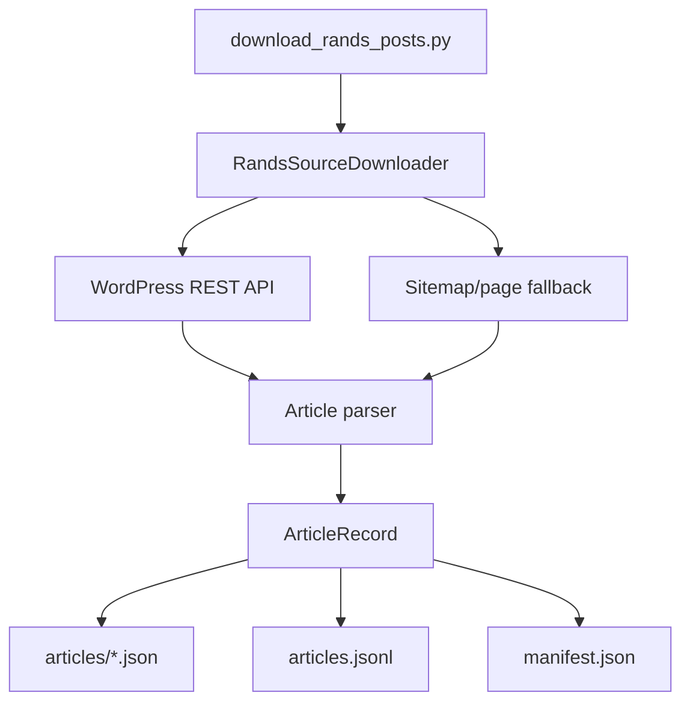

# MVP Data Spec

This is an AI-derived data specification. It is not authority over `KERNEL/`.

## Source Data

The source ingestion pipeline downloads Rands in Repose articles into local
structured files for analysis and app development.



MVP source ingestion excludes blog comments.

## Personality Data

Flat JSON personality records define the possible quiz outcomes.

| Field | Type | Required | Notes |
| --- | --- | --- | --- |
| `id` | string | yes | Stable scoring key and readable route id. |
| `name` | string | yes | Display name. |
| `description` | string | yes | Result text shown to the user. |
| `source_slugs` | string[] | yes | At least one Rands in Repose article slug. |

Rules:

- There must be at least one personality.
- Every personality must include at least one source slug.
- Source slugs are resolved to Rands in Repose links for result display.
- Personality ids are the only valid keys in answer score maps.

## Question Data

Flat JSON question records define the quiz.

| Field | Type | Required | Notes |
| --- | --- | --- | --- |
| `id` | string | yes | Versioned id in `qN-vN` format. |
| `text` | string | yes | Prompt shown to the user. |
| `source_slugs` | string[] | yes | Source grounding for the question. |
| `answers` | array | yes | At least one answer, normally 3 or 4. |
| `answers[].text` | string | yes | Answer label shown to the user. |
| `answers[].scores` | object | yes | Sparse personality id to integer weight map. |

Rules:

- Every question must have at least one answer.
- The question bank must contain at most 13 questions. (Raised from the MVP 12
  to add `q21-v1`, a planning-season question that grounds The Mario
  personality, source `the-mario-meeting`. The relaxation of the derived
  `requirements-v3` cap is recorded in `data-integrity.test.ts`; no KERNEL
  invariant caps the question count.)
- Every question must reference source material from Rands in Repose.
- Every question must be able to change the final outcome.
- A question can change the outcome when two of its answers can produce
  different winning personality types while the rest of the answer path is held
  fixed.
- Reworded or rebalanced questions should use a new versioned id.

## Scoring Data

Scores are sparse. An answer lists only the personalities it influences.

Example:

```json
{
  "text": "Walk the engineer through debugging it so they learn",
  "scores": {
    "coach": 3
  }
}
```

Missing personality ids count as zero for that answer.

## Reachability

Every personality must be reachable. For MVP validation, this means there is at
least one complete answer path through all questions that ranks that personality
first after applying sparse scoring.

Ties do not prove reachability unless the application explicitly treats tied
first place as a valid outcome for each tied personality.
