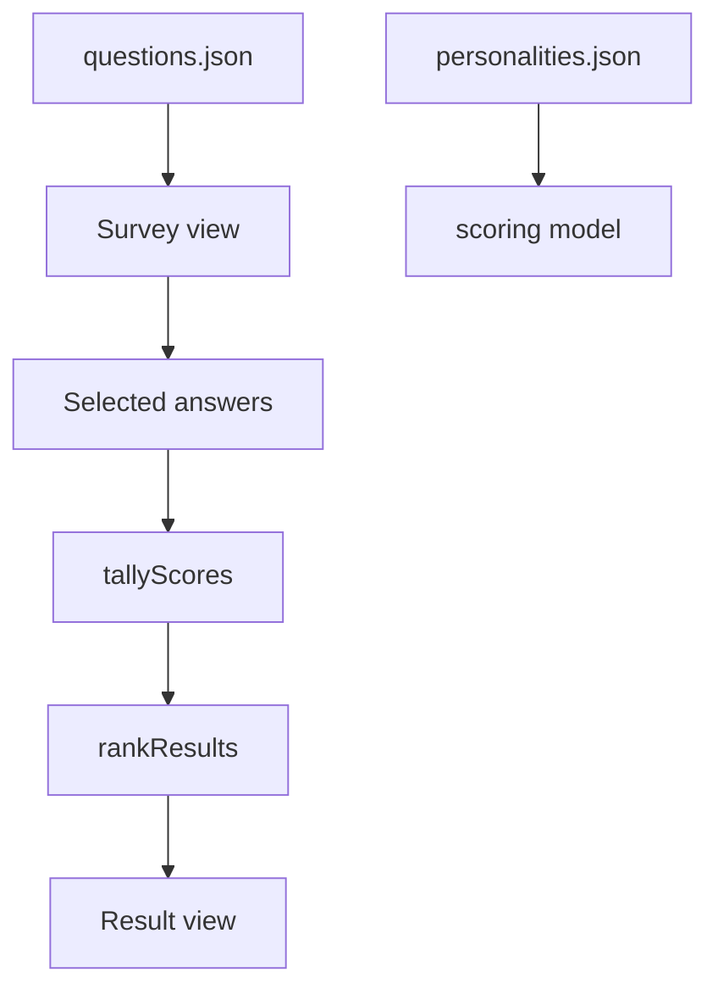

# MVP Scoring Spec

This is an AI-derived scoring specification. It is not authority over `KERNEL/`.

## Scope

The MVP uses deterministic sparse score accumulation over a linear question
flow. There is no adaptive question engine in the MVP spec.

## Model Boundary

Scoring belongs in the domain model layer. React views may collect selections
and render results, but they should not contain ranking or score aggregation
business logic.

## `tallyScores`

Input:

- ordered or unordered list of selected answers

Output:

- map of personality id to accumulated integer score

Rules:

- Add each answer's sparse score weights to the running total.
- Treat absent personality ids as zero.
- Preserve integer score totals.

## `rankResults`

Input:

- score totals
- personality definitions

Output:

- list of scored personalities sorted from best match to weakest match

Rules:

- Higher score ranks first.
- Ties use a deterministic tie-breaker.
- The result personality is the first ranked item.
- Unknown score keys must not create unknown personalities.
- Personalities with no score are ranked with score zero.

## Restart

Restart returns the scoring state to the initial state:

- no selected answers
- no accumulated score totals
- first question selected for display

## High-Value Tests

- Tallies sparse scores across multiple selected answers.
- Treats missing score keys as zero.
- Ranks the highest score first.
- Uses deterministic tie-breaking.
- Includes zero-score personalities in the ranking.
- Restart clears selected answers and score totals.
