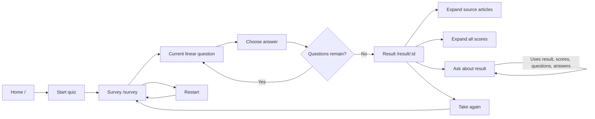

# MVP Product Spec

This is an AI-derived MVP specification. It is not authority over `KERNEL/`.

## Scope

The MVP is a React and TypeScript single page app that asks the user the quiz
questions from the question bank, accumulates sparse scores, and displays the
best matching Rands in Repose personality.

Kernel note: `requirements-v3.md` describes a linear MVP. The current
`architecture.md` still references adaptive behavior. Because both are kernel
inputs, implementation work must reconcile that conflict explicitly before
changing runtime behavior.

## User Journey

## Functional Requirements

- The app asks all questions from the question bank in linear order.
- The question bank contains at most 12 questions.
- Each answer contributes sparse score weights to one or more personalities.
- Scores are accumulated as the user answers questions.
- The result is the highest-ranked personality after all questions are answered.
- Restart is available during the quiz and resets accumulated scores and answer
  progress.
- Users cannot go back and modify previous answers in the MVP.
- The result route uses a readable personality id, such as `/result/wolf`.
- The result page shows the winning personality.
- The result page exposes all personality scores through an expandable section.
- The result page exposes Rands in Repose source references for the result
  personality.
- Chat is available only after the user reaches a result with final score state.
- Chat prompts include the final personality, nearby ranked personalities,
  completed quiz questions, and the user's selected answers.
- Chat responses persist in the current result session until the user starts or
  restarts the quiz.
- Chat submissions are disabled after 3 answered chat interactions with a
  visible interaction count.

## UX Requirements

- Use a minimalist light-mode design.
- Use Material UI.
- Prefer readable text and simple layout over decorative imagery.
- Support mobile and flexible resizing.
- Use progressive disclosure for secondary details such as sources and scores.

## Non-Goals

- Adaptive question selection.
- Early stopping before all questions are answered.
- Bayesian posterior scoring.
- Going back to edit previous answers.
- Blog comment ingestion.
- Full analytics or saved historical results.

## Acceptance Criteria

- A user can start at `/`, answer every question at `/survey`, and reach a
  readable result route.
- Restart from the survey clears prior score/progress state.
- The result is computed from the accumulated sparse answer scores.
- The winning personality includes at least one Rands in Repose source
  reference.
- Expanded score details show the complete score table used for ranking.
- Chat answers can use the user's completed quiz questions and selected answers
  as context.
- Chat turns remain visible on the current result route until the user starts
  over.
