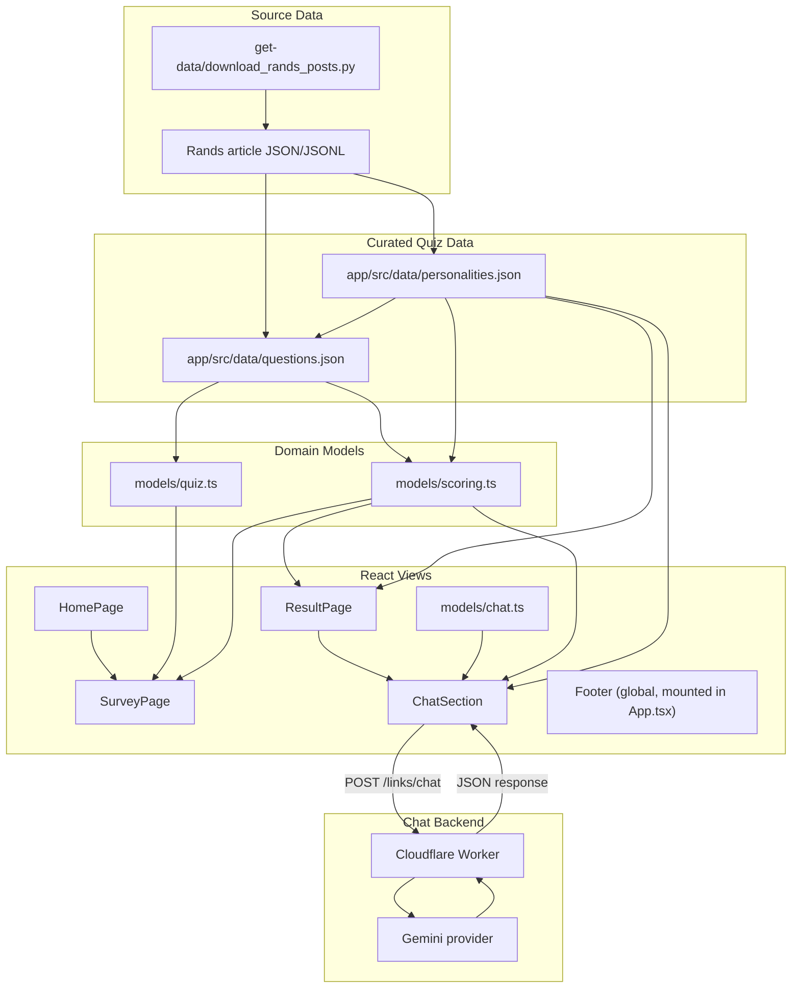
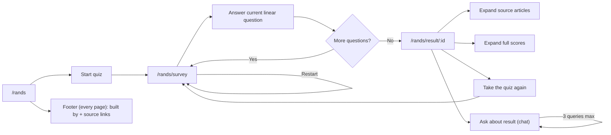
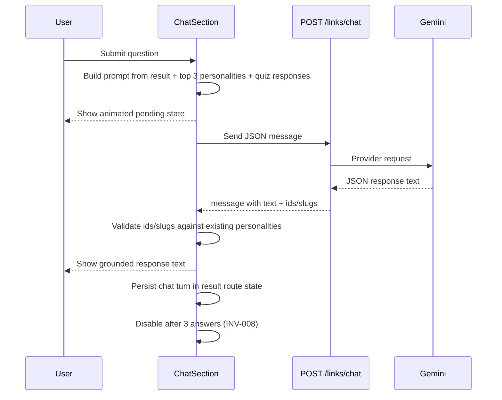

# Architecture

This document is AI-derived from `KERNEL/`, `SPEC/`, and `VALIDATION/`.
`KERNEL/` remains the authority if this document conflicts with it.

## System Design



## User Journey



## Chat Journey



## Layers

- `app/src/models/quiz.ts` owns linear quiz progression: current question,
  selected answers, completion, restart state, and progress.
- `app/src/models/scoring.ts` owns sparse score aggregation and deterministic
  result ranking.
- `app/src/models/chat.ts` owns chat prompt construction, response parsing,
  quiz response context construction, practical application guidance, grounding
  validation (INV-007), session limits (INV-008), and response truncation (max
  9 paragraphs or 300 sentences).
- `app/src/components/ChatSection.tsx` owns the chat UI: input, query counter,
  animated pending state, turn history, and error display. Calls model
  functions for all business logic.
- `app/src/views/ResultPage.tsx` owns result route state for totals, quiz
  response context, and persisted chat turns. Starting the quiz again leaves
  that result state behind.
- `app/src/data/` owns static curated personality and question JSON. The MVP
  question bank is capped at 12 questions.
- `app/src/views/` owns presentation, routing, and user interaction.
- `app/src/components/Footer.tsx` is a pure presentational global footer
  rendered once in `App.tsx` (inside the `ThemeProvider`, after the
  `RouterProvider`) so it appears on every route: a "Built by John Pfeiffer"
  line with LinkedIn and GitHub source-link icons (`@mui/icons-material`),
  the GitHub link pointing at this repository. Covered by `Footer.test.tsx`.

Business logic should stay in `models`; React views should call model functions
instead of embedding scoring or quiz-progression rules.

## Invariants

The app validates the kernel invariants in
`app/src/data/data-integrity.test.ts` and `app/src/models/chat.test.ts`:

- at least one personality exists
- every personality has source slugs that resolve to Rands in Repose links
- every question has at least one answer
- every question has source slugs that resolve to Rands in Repose links
- every question has answer choices that can change the final winner
- every personality is reachable through answer choices
- chat responses only reference existing personality types and source slugs (INV-007)
- chat is available only when final scores exist (INV-007)
- chat sessions disable after 3 answers with a visible counter (INV-008)
- chat prompts incorporate quiz questions and selected answers, and chat turns
  persist in result route state until the user starts over (INV-009)

## TLA+

The generated formal model lives in `SPEC/RandsPersonalityGame.tla`.
The runnable TLC harness lives in `VALIDATION/`.

The TLA+ domain predicates currently cover the data/scoring invariants `INV001`
through `INV006`. Chat/session invariants `INV007` through `INV009` are covered
by app model and view tests because they describe UI/session behavior.

## Validation

For app changes:

```bash
cd app
npm test
npm run build
```

Run `npm run lint` when TypeScript, React, or build configuration changes.

For the generated TLA+ invariant check, use the command documented in
`VALIDATION/tla.md`.
