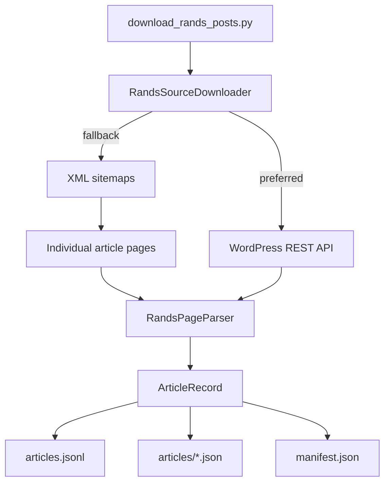

# Architecture

## Goal

"Which Personality Game" has multiple parts

- a downloader of source articles

## System Design

## Layering

- `models/article.py` holds the core article record.
- `models/rands_source.py` contains the domain logic for discovery and extraction.
- `download_rands_posts.py` acts as the controller entry point that turns domain results into files on disk.

## Output Contract

- `data/articles.jsonl` stores one article per line for batch processing.
- `data/articles/*.json` stores one file per article for debugging and manual inspection.
- `data/manifest.json` records the run metadata and article counts.

