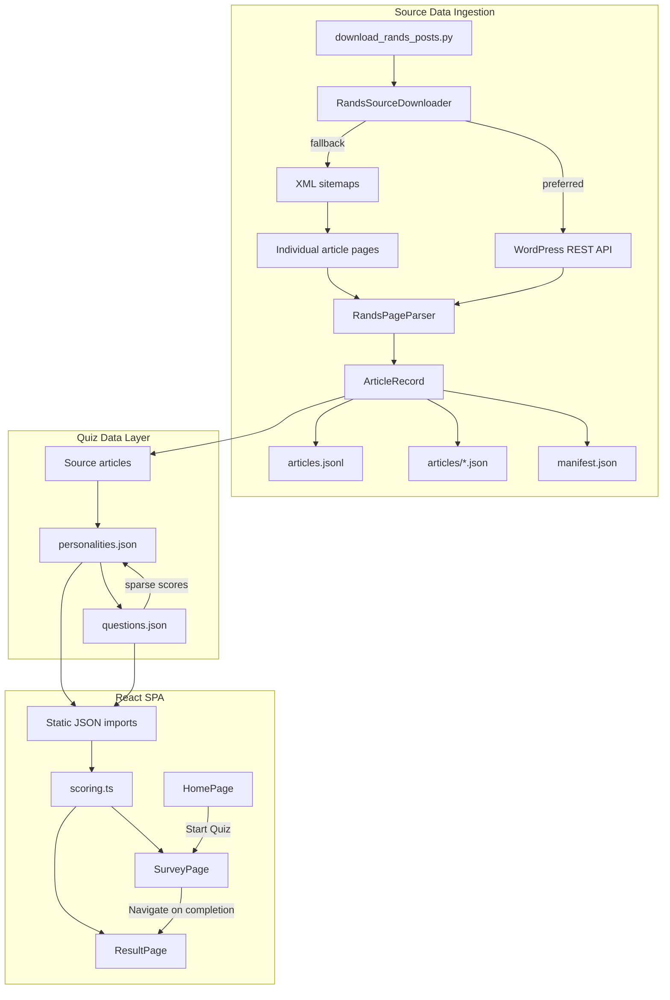
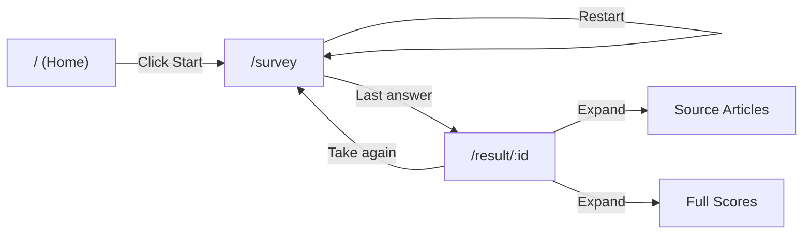

# Architecture

## Goal

"Which Personality Game" has multiple parts

- a downloader of source articles
- extracted personality and quiz data that underpins the game
- a React SPA quiz that matches the user to a personality

## System Design

## User Journey

## Layering

### v1 — Source data ingestion

- `models/article.py` holds the core article record.
- `models/rands_source.py` contains the domain logic for discovery and extraction.
- `download_rands_posts.py` acts as the controller entry point that turns domain results into files on disk.

### v2 — Quiz data

- `data/personalities.json` defines 20 personality archetypes with descriptions and source article references.
- `data/questions.json` defines 20 versioned quiz questions with answers that carry sparse scores toward personalities.
- No pipeline or scripts required — these files are hand-curated.

### v3 — React SPA (`app/`)

- **Models** (`src/models/`): Domain types (`types.ts`) and scoring logic (`scoring.ts`) — pure functions, no React dependency.
- **Data** (`src/data/`): Static JSON imports with a typed accessor (`getPersonalityById`).
- **Views** (`src/views/`): Three route-level components — `HomePage`, `SurveyPage`, `ResultPage`.
- **Routing**: React Router with `/`, `/survey`, `/result/:id`.
- **Styling**: Material-UI light theme, minimalist, mobile-friendly.

## Output Contract

### v1

- `data/articles.jsonl` stores one article per line for batch processing.
- `data/articles/*.json` stores one file per article for debugging and manual inspection.
- `data/manifest.json` records the run metadata and article counts.

### v2

- `data/personalities.json` stores personality definitions keyed by `id` (e.g. `"fixer"`).
- `data/questions.json` stores versioned questions (`qN-vN`) with sparse answer-to-personality scoring.

### v3

- `app/dist/` is the production build output (static files, deployable to Cloudflare Pages).
- Routes: `/` → Home, `/survey` → Quiz, `/result/:id` → Result.
