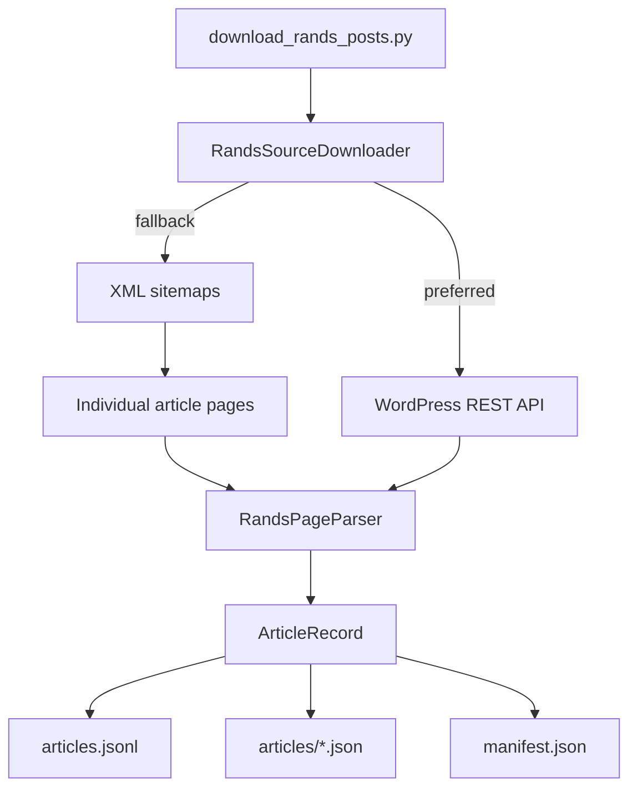
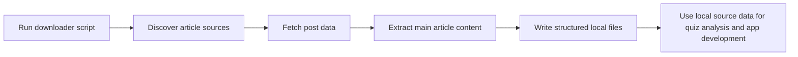

# Architecture

## Goal

Build a local source-data pipeline for the personality quiz by downloading Rands in Repose articles into a structured format that is easy to inspect, transform, and analyze.

## System Design

## User Journey

## Layering

- `models/article.py` holds the core article record.
- `models/rands_source.py` contains the domain logic for discovery and extraction.
- `download_rands_posts.py` acts as the controller entry point that turns domain results into files on disk.

## Output Contract

- `data/rands/articles.jsonl` stores one article per line for batch processing.
- `data/rands/articles/*.json` stores one file per article for debugging and manual inspection.
- `data/rands/manifest.json` records the run metadata and article counts.
