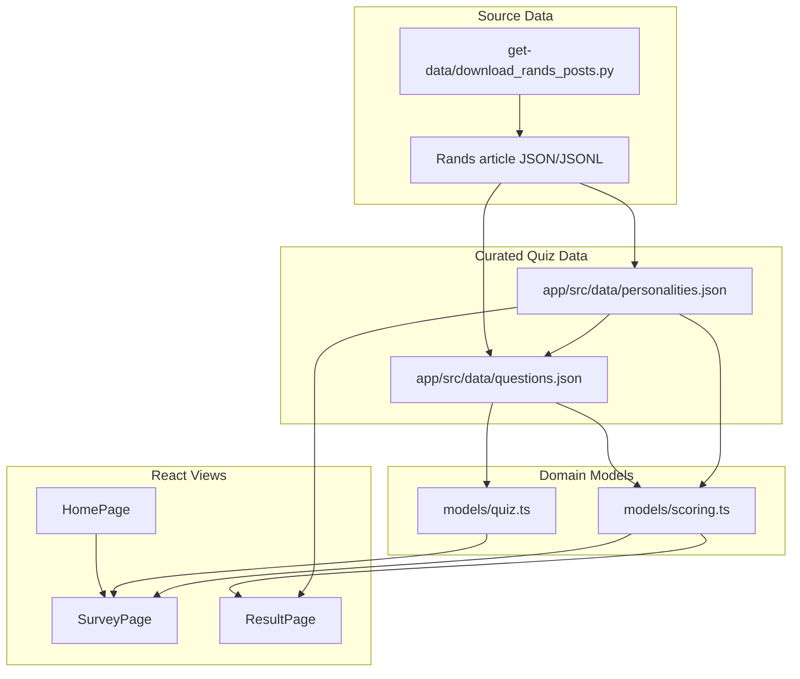
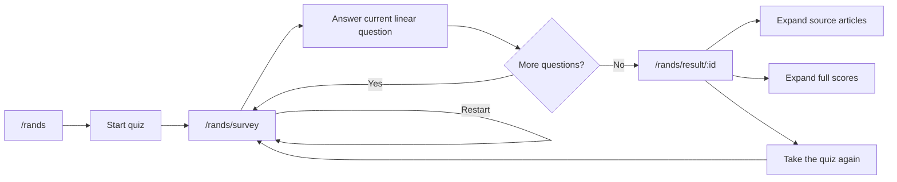

# Architecture

This document is AI-derived from `KERNEL/`, `SPEC/`, and `VALIDATION/`.
`KERNEL/` remains the authority if this document conflicts with it.

## System Design


```mermaid
flowchart TD
    subgraph Source["Source Data"]
        Downloader["get-data/download_rands_posts.py"] --> Articles["Rands article JSON/JSONL"]
    end

    subgraph Data["Curated Quiz Data"]
        Articles --> Personalities["app/src/data/personalities.json"]
        Articles --> Questions["app/src/data/questions.json"]
        Personalities --> Questions
    end

    subgraph Models["Domain Models"]
        Questions --> QuizModel["models/quiz.ts"]
        Questions --> ScoringModel["models/scoring.ts"]
        Personalities --> ScoringModel
    end

    subgraph Views["React Views"]
        Home["HomePage"] --> Survey["SurveyPage"]
        QuizModel --> Survey
        ScoringModel --> Survey
        ScoringModel --> Result["ResultPage"]
        Personalities --> Result
    end
```

## User Journey


```mermaid
flowchart LR
    A["/rands"] --> B["Start quiz"]
    B --> C["/rands/survey"]
    C --> D["Answer current linear question"]
    D --> E{"More questions?"}
    E -->|Yes| C
    E -->|No| F["/rands/result/:id"]
    C -->|Restart| C
    F --> G["Expand source articles"]
    F --> H["Expand full scores"]
    F --> I["Take the quiz again"]
    I --> C
```

## Layers

- `app/src/models/quiz.ts` owns linear quiz progression: current question,
  selected answers, completion, restart state, and progress.
- `app/src/models/scoring.ts` owns sparse score aggregation and deterministic
  result ranking.
- `app/src/data/` owns static curated personality and question JSON.
- `app/src/views/` owns presentation, routing, and user interaction.

Business logic should stay in `models`; React views should call model functions
instead of embedding scoring or quiz-progression rules.

## Invariants

The app validates the six kernel invariants in
`app/src/data/data-integrity.test.ts`:

- at least one personality exists
- every personality has source slugs that resolve to Rands in Repose links
- every question has at least one answer
- every question has source slugs that resolve to Rands in Repose links
- every question modifies at least one score
- every personality is reachable through answer choices

## TLA+

The generated formal model lives in `SPEC/RandsPersonalityGame.tla`.
The runnable TLC harness lives in `VALIDATION/`.

The TLA+ domain predicates are exactly `INV001` through `INV006`, matching
`KERNEL/INVARIANTS.md`.

## Validation

For app changes:

```bash
cd app
npm test
npm run build
```

Run `npm run lint` when TypeScript, React, or build configuration changes.

For the generated TLA+ invariant check, use the command documented in
`VALIDATION/tla.md`.
